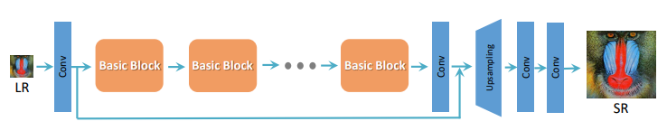
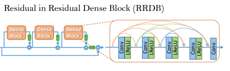
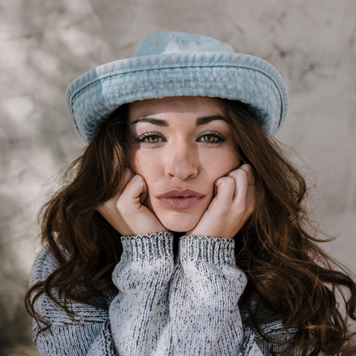

# ESRGAN-pytorch

This repository implements a deep-running model for super resolution.
 Super resolution allows you to pass low resolution images to CNN and restore them to high resolution. 
 We refer to the following article.  
 [ESRGAN: Enhanced Super-Resolution Generative Adversarial Networks](https://arxiv.org/abs/1809.00219)  
 
 ## architecture
 [Overall Architecture]
   
 [Basic block]  
 
 
 ### Test Code
 ```bash
python test.py --lr_dir LR_DIR --sr_dir SR_DIR
```
 
 ## Prepare dataset
 ### Use Flicker2K and DIV2K
```bash
cd datasets
python prepare_datasets.py
cd ..
```
### custom dataset
Make dataset like this; size of hr is 128x128 ans lr is 32x32
```
datasets/
    hr/
        0001.png
        sdf.png
        0002.png
        0003.png
        0004.png
        ...
    lr/
        0001.png
        sdf.png
        0002.png
        0003.png
        0004.png
        ...
```

## how to train
run main file
```bash
python main.py --is_perceptual_oriented True --num_epoch=10
python main.py --is_perceptual_oriented False --epoch=10
```

## Sample
we are in training on this code and train is not complete yet.
this is intermediate result.



